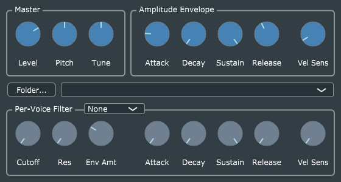

# JUCE-AKSampler

This example illustrates using the [JUCE framework](http://juce.com) to wrap the *AKSampler* instrument from *AudioKitCore* for deployment as a desktop app and plug-in. It's essentially a desktop version of the [AudioKit Sampler Demo](https://github.com/AudioKit/SamplerDemo) for iOS and macOS.

To compile this, you will need to obtain your own copy of the JUCE framework. If you want to build VST or VST3 plug-ins, you will also need a copy of the appropriate SDK from [Steinberg](https://www.steinberg.net/en/company/developers.html) ("VST" is a trademark of Steinberg Media Technologies GmbH). To distribute VST/VST3 plug-ins you must obtain a license from Steinberg.

Note the JUCE framework is dual-licensed. A commercial license is required if you want to distribute a JUCE-based program as closed-source, but the framework can also be used at no charge for open-source works, provided the GPL3 license is used, as is the case here.

The original code published here is offered under the terms of the [MIT License](https://opensource.org/licenses/MIT) (as is the rest of the [AudioKit framework](https://github.com/AudioKit/AudioKit)). This grants you even greater freedom than the GPL3, but note this *does not extend to cover the JUCE framework*, which is subject to its own license terms.

David Bryant's excellent [WavPack audio compression library](https://github.com/dbry/WavPack) is used in this example, to allow users to load the sample sets linked below, from the original AKSampler Demo repo. It's very easy to remove, however, if (as will usually be the case) you only need to use samples in conventional format like WAV, AIF, etc. which are already supported by JUCE.

## Using the JUCE AKSampler
The AudioKit *AKSampler* C++ class is documented at https://github.com/AudioKit/AudioKit/blob/master/docs/AKSampler.md.

This implementation makes use of *a simplified form of the* "SFZ" metafile format, which is described in detail at https://github.com/AudioKit/AudioKit/blob/master/docs/PreparingSampleSets.md. **THIS IS NOT A FULL SFZ PLAYER**. If that's what you're looking for, check out Steve Folta's impressive [SFZero project here on GitHub](http://stevefolta.github.io/SFZero/).

You can get a basic set of four pre-built SFZs and samples from the original AudioKit Sampler Demo repo at https://github.com/AudioKit/SamplerDemo/tree/master/Sounds. We strongly recommend that you test the JUCE AKSampler with these sample-sets before attempting to create your own.

When instantiated as a plug-in in a typical DAW or other host program, the JUCE AKSampler GUI appears as in the screenshot above. (The result of code shared from the open-source [SARAH synthesizer](https://github.com/getdunne/SARAH).) The stand-alone executable looks similar, but has an "Options" button at the top. The first time you run the program, click this to select your Audio interface and MIDI input device. (Your selections should be remembered for subsequent runs.)

Click the "Folder..." button to select the folder containing your .SFZ files, then select a specific file from the drop-down menu (combo box) to the right of the button to load the samples. Once they are loaded, you should be able to play with up to 64 voices of polyphony.

*AKSampler* offers a single LFO, which in this implementation is hard-wired to apply vibrato. Use your MIDI keyboard's mod wheel to control this. You can also use your controller's pitch bend control to slide note pitch up or down up to 2 semitones.

*AKSampler* also provides a per-voice resonant low-pass filter, with its own ADSR envelope generator. By default, the filters are disabled. The drop-down menu above the filter controls allows you to select 1, 2, 3, or 4 identical filter stages (connected in cascade). One stage provides 12 dB/octave rolloff, two stages provide 24 dB/octave, etc.
